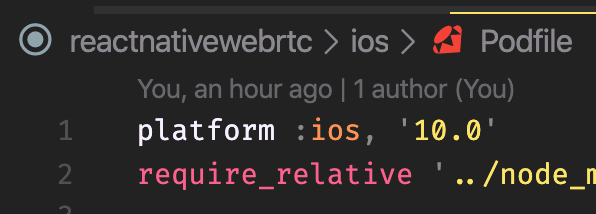
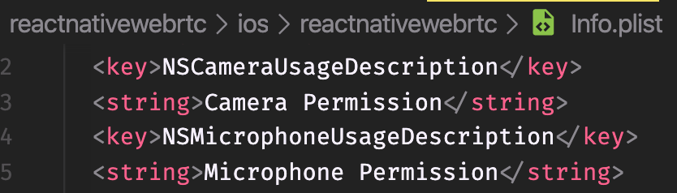
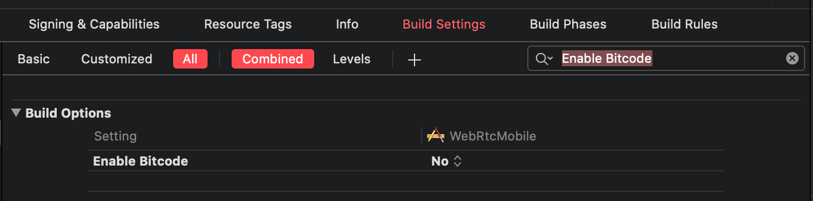

# React native with react-native-webrtc

This is my source base when i integrate react native with react-native-webrtc


## Getting Started

- [React Native](https://reactnative.dev/)
- [WebRTC](https://webrtc.org/)

### Prerequisites

If you integrate to your new project, following below steps:

1. npm i react-native-webrtc
2. edit Podfile, platform: ios >= 10.0
   <br/>
   
3. cd ios && pod install
4. edit Info.plist, add 2 permissions
   <br/>
   
5. edit Enable Bitcode: No
   <br/>
   
6. start ios or android

### Installing

- clone repository

```
  https://github.com/chnirt/react-native-webrtc.git
```

- cd into directory

```
  cd react-native-webrtc/
```

- edit Enable Bitcode: No

  

- install dependencies

```
  npm i
```

- start ios or android

```
  npm run ios
  npm run android
```

## Built With

- [react-native-webrtc](https://github.com/react-native-webrtc/react-native-webrtc) - A WebRTC module for React Native.

## Authors

- **Chin Trinh** - _Initial work_ - [Illusion-dev
  ](https://github.com/chnirt)

## Acknowledgments

- [Inspiration](https://github.com/baconcheese113/react-native-webrtc-minimal)
- etc

## Error

- https://support.medialooks.com/hc/en-us/articles/360002981111-SFU-Selective-Forwarding-Unit-

- https://github.com/meetecho/janus-gateway/issues/90
